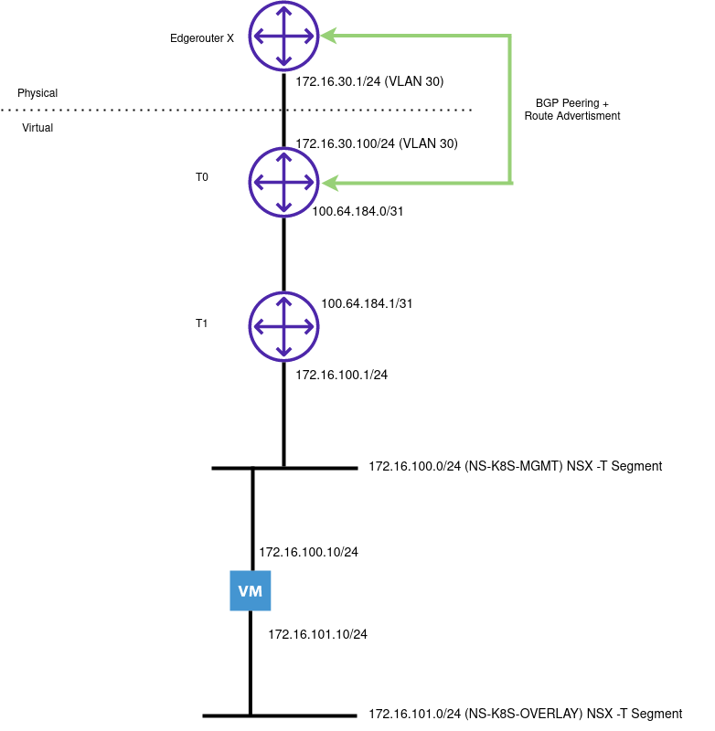
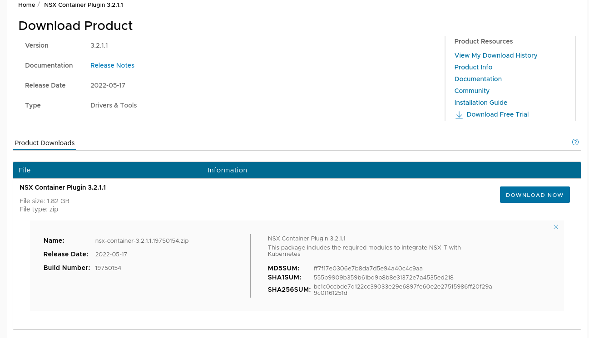
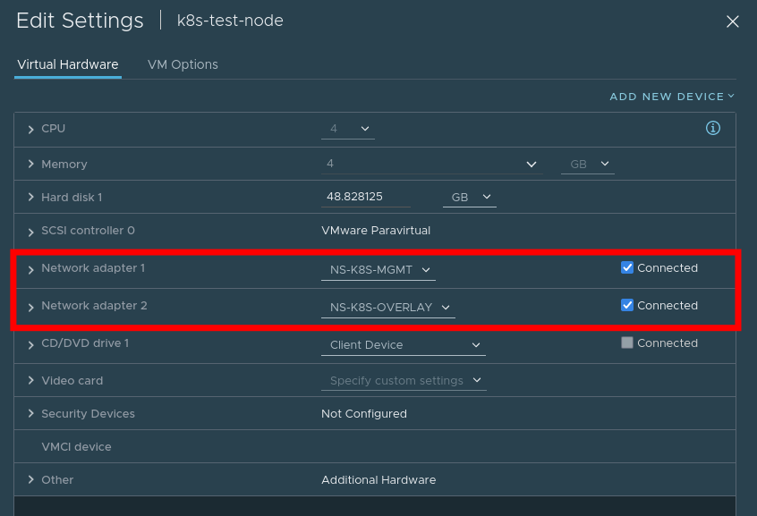
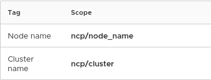
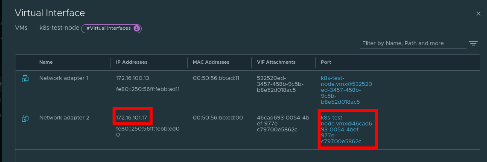
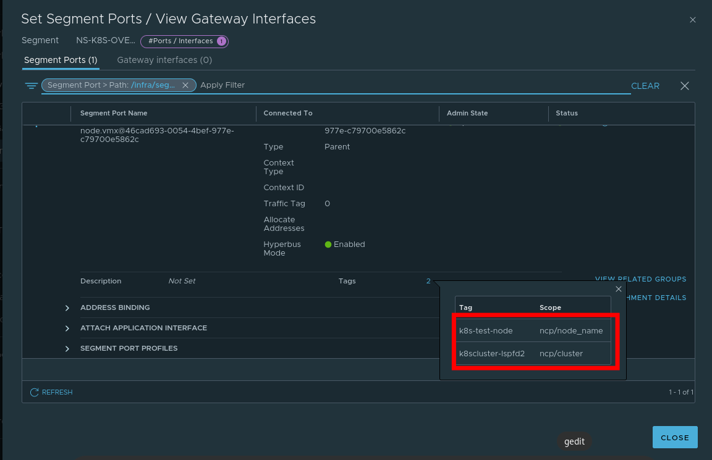

# RKE2 and NSX-T

This document outlines a basic implementation of the VMware NSX-T CNI plugin for RKE2

# 1. Planning

The following illustrates my Lab environment with a single node cluster:



## General Considerations

If you have a new NSX-T environment, ensure you have (as a minimum) the following:

* T0 Router
* T1 Router
* Edge Cluster
* VLAN Transport Zone
* Overlay Transport Zone
* Route advertisment (BGP/OSPF) to the physical network

## NSX Specific Considerations

* A network segment (or vds port) for management traffic (NS-K8S-MGMT in this example)
* A network segment for overlay traffic (NS-K8S-OVERLAY)

Management traffic should be put on a routed network  
Overlay traffic does not have to be on a routed network

You will need to acquire and upload the ncp container image to a private repo:



This will contain the NCP image

# 2. Prepare NSX Objects

* Create and retrieve the object ID's for:
* An IP Block for the Pods (this /16 will be divided into /24's in our cluster)


* An IP Pool for `loadBalancer` service types


# 3. Create VM

* Create a VM with one nic attached to the Management network, and one attached to the Overlay network. Note, for ease you can configure NSX-T to provide DHCP services to both



* Ensure `Python` is Installed (aka Python2)

# 4. Install RKE2

* Create the following configuration file to instruct RKE2 not to auto-apply a CNI:

```shell
packerbuilt@k8s-test-node:~$ cat /etc/rancher/rke2/config.yaml 
cni:
  - none
```

* Install RKE2

```shell
curl -sfL https://get.rke2.io | sh -
systemctl enable rke2-server.service
systemctl start rke2-server.service
# Wait a bit
export KUBECONFIG=/etc/rancher/rke2/rke2.yaml PATH=$PATH:/var/lib/rancher/rke2/bin
kubectl get nodes
```

* You will notice some pods are in `pending` state - this is normal as these reside outside of the host networking namespace and we have yet to install a CNI

# 5. Install additional CNI binaries

* NSX-T also requires access to thr `portmap` CNI binary. this can be acquired by:

```shell
wget https://github.com/containernetworking/plugins/releases/download/v1.1.1/cni-plugins-linux-amd64-v1.1.1.tgz
```

* Extract the contents to `/opt/cni/bin/`

# 6. Tag the overlay network port on the VM

The NSX-T container plugin needs to identify the port used for container traffic. In the example above, this is the interface connection to our Overlay switch



* In NSX-T navigate to `Inventory -> Virtual Machines -> Select the VM`
* Select the port that's connected to the overlay switch



* Add the tags as appropiate




# 7. Download the NCP operator files

* `git clone https://github.com/vmware/nsx-container-plugin-operator`
* Change directory - `cd /deploy/kubernetes/`

# 8. Change the Operator yaml

* `Operator.yaml` - replace where the image resides in your environment. Example:

```
            - name: NCP_IMAGE
              value: "core.harbor.virtualthoughts.co.uk/library/nsx-ncp-ubuntu:latest"
```

# 9. Change the Configmap yaml file

Which values to change will depend on your deployment topology, but as an example:

```diff
@@ -11,7 +11,7 @@ data:
 
     # If set to true, the logging level will be set to DEBUG instead of the
     # default INFO level.
-    #debug = False
+    debug = True
 
 
 
@@ -52,10 +52,10 @@ data:
     [coe]
 
     # Container orchestrator adaptor to plug in.
-    #adaptor = kubernetes
+    adaptor = kubernetes
 
     # Specify cluster for adaptor.
-    #cluster = k8scluster
+    cluster = k8scluster-lspfd2
 
     # Log level for NCP modules (controllers, services, etc.). Ignored if debug
     # is True
@@ -111,10 +111,10 @@ data:
     [k8s]
 
     # Kubernetes API server IP address.
-    #apiserver_host_ip = <None>
+    apiserver_host_ip = 172.16.100.13
 
     # Kubernetes API server port.
-    #apiserver_host_port = <None>
+    apiserver_host_port = 6443
 
     # Full path of the Token file to use for authenticating with the k8s API
     # server.
@@ -129,7 +129,7 @@ data:
     # Specify whether ingress controllers are expected to be deployed in
     # hostnework mode or as regular pods externally accessed via NAT
     # Choices: hostnetwork nat
-    #ingress_mode = hostnetwork
+    ingress_mode = nat
 
     # Log level for the kubernetes adaptor. Ignored if debug is True
     # Choices: NOTSET DEBUG INFO WARNING ERROR CRITICAL
@@ -254,7 +254,7 @@ data:
 
 
     # The OVS uplink OpenFlow port where to apply the NAT rules to.
-    #ovs_uplink_port = <None>
+    ovs_uplink_port = ens224
 
     # Set this to True if you want to install and use the NSX-OVS kernel
     # module. If the host OS is supported, it will be installed by nsx-ncp-
@@ -318,8 +318,11 @@ data:
     # [<scheme>://]<ip_adress>[:<port>]
     # If scheme is not provided https is used. If port is not provided port 80
     # is used for http and port 443 for https.
-    #nsx_api_managers = []
-
+    nsx_api_managers = 172.16.10.43
+    nsx_api_user = admin
+    nsx_api_password = SuperSecretPassword123!
+    insecure = true
+    
     # If True, skip fatal errors when no endpoint in the NSX management cluster
     # is available to serve a request, and retry the request instead
     #cluster_unavailable_retry = False
@@ -438,7 +441,7 @@ data:
     # support automatically creating the IP blocks. The definition is a comma
     # separated list: CIDR,CIDR,... Mixing different formats (e.g. UUID,CIDR)
     # is not supported.
-    #container_ip_blocks = []
+    container_ip_blocks = IB-K8S-PODS 
 
     # Resource ID of the container ip blocks that will be used for creating
     # subnets for no-SNAT projects. If specified, no-SNAT projects will use
@@ -451,7 +454,7 @@ data:
     # creating the ip pools. The definition is a comma separated list:
     # CIDR,IP_1-IP_2,... Mixing different formats (e.g. UUID, CIDR&IP_Range) is
     # not supported.
-    #external_ip_pools = []
+    external_ip_pools = IP-K8S-LB
 
 
 
@@ -461,7 +464,7 @@ data:
     # Name or ID of the top-tier router for the container cluster network,
     # which could be either tier0 or tier1. If policy_nsxapi is enabled, should
     # be ID of a tier0/tier1 gateway.
-    #top_tier_router = <None>
+    top_tier_router = T0
 
     # Option to use single-tier router for the container cluster network
     #single_tier_topology = False
@@ -472,13 +475,13 @@ data:
     # policy_nsxapi is enabled, it also supports automatically creating the ip
     # pools. The definition is a comma separated list: CIDR,IP_1-IP_2,...
     # Mixing different formats (e.g. UUID, CIDR&IP_Range) is not supported.
-    #external_ip_pools_lb = []
+    #external_ip_pools_lb = IP-K8S-LB
 
     # Name or ID of the NSX overlay transport zone that will be used for
     # creating logical switches for container networking. It must refer to an
     # already existing resource on NSX and every transport node where VMs
     # hosting containers are deployed must be enabled on this transport zone
-    #overlay_tz = <None>
+    overlay_tz = nsx-overlay-transportzone
 
 
     # Resource ID of the lb service that can be attached by virtual servers
@@ -500,11 +503,11 @@ data:
 
     # Resource ID of the firewall section that will be used to create firewall
     # sections below this mark section
-    #top_firewall_section_marker = <None>
+    top_firewall_section_marker = 0eee3920-1584-4c54-9724-4dd8e1245378
 
     # Resource ID of the firewall section that will be used to create firewall
     # sections above this mark section
-    #bottom_firewall_section_marker = <None>
+    bottom_firewall_section_marker = 3d67b13c-294e-4470-95db-7376cc0ee079
 
 
 
@@ -523,7 +526,7 @@ data:
 
     # Edge cluster ID needed when creating Tier1 router for loadbalancer
     # service. Information could be retrieved from Tier0 router
-    #edge_cluster = <None>
+    edge_cluster = 726530a3-a488-44d5-aea6-7ee21d178fbc
```

# 10. Apply the manifest files

```shell
kubectl apply -f /nsx-container-plugin-operator/deploy/kubernetes/*
```

You should see both the operator and NCP workloads manifest

```shell
root@k8s-test-node:/home/packerbuilt/nsx-container-plugin-operator/deploy/kubernetes# kubectl get po -n nsx-system
NAME                       READY   STATUS    RESTARTS   AGE
nsx-ncp-5666788456-r4nzb   1/1     Running   0          4h31m
nsx-ncp-bootstrap-6rncw    1/1     Running   0          4h31m
nsx-node-agent-6rstw       3/3     Running   0          4h31m
root@k8s-test-node:/home/packerbuilt/nsx-container-plugin-operator/deploy/kubernetes# kubectl get po -n nsx-system-operator
NAME                               READY   STATUS    RESTARTS   AGE
nsx-ncp-operator-cbcd844d4-tn4pm   1/1     Running   0          4h31m
```

Pods should be transitioning to `running` state, and loadbalancer services will be facilitated by NSX

```shell
root@k8s-test-node:/home/packerbuilt/nsx-container-plugin-operator/deploy/kubernetes# kubectl get svc
NAME            TYPE           CLUSTER-IP     EXTERNAL-IP     PORT(S)        AGE
kubernetes      ClusterIP      10.43.0.1      <none>          443/TCP        4h34m
nginx-service   LoadBalancer   10.43.234.41   172.16.102.24   80:31848/TCP   107m
root@k8s-test-node:/home/packerbuilt/nsx-container-plugin-operator/deploy/kubernetes# curl 172.16.102.24
<!DOCTYPE html>
<html>
<head>
<title>Welcome to nginx!</title>
<style>
    body {
      ......
    }
```

The end result is a topology where every namespace has its own T1 router, advertised to T0:

